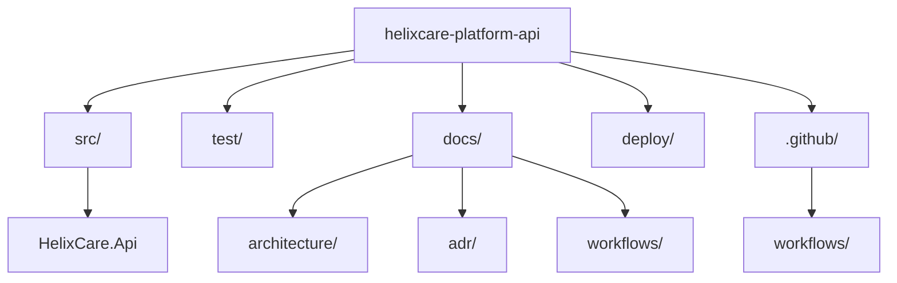

# HelixCare Platform API

HelixCare is a fictional healthcare platform designed to simulate
a modern enterprise-scale healthcare ecosystem.

This repository contains the foundational API service and CI pipeline
used to establish the platform delivery baseline.

---

## Purpose

This project exists to:

- Establish a repeatable CI/CD pipeline
- Provide a baseline ASP.NET API service
- Demonstrate enterprise engineering practices
- Serve as the foundation for future HelixCare services

---

## Current Capabilities

- ASP.NET Core Web API (.NET 9)
- Swagger/OpenAPI enabled
- GitHub Actions CI pipeline
- Enterprise-style repository structure

---

## Repository Structure


---

## Running Locally

From repository root:

```bash
dotnet restore src/HelixCare.Api/HelixCare.Api.sln
dotnet run --project src/HelixCare.Api
```

Swagger will be available at:  https://localhost:xxxx/swagger


---

## Architecture Documentation

See:
- [Architecture Documentation](docs/architecture/README.md)

---

## Architectural Decisions

See:
- [Architecture Decision Records](docs/adr/README.md)


---

## Roadmap (High-Level)

Upcoming development includes:

- Replace WeatherForecast placeholder
- Add automated tests
- Introduce containerisation
- Deploy to Azure
- Introduce domain services (MPI, Referrals, etc.)

---

## Status

Active development — foundational platform phase.